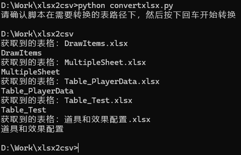
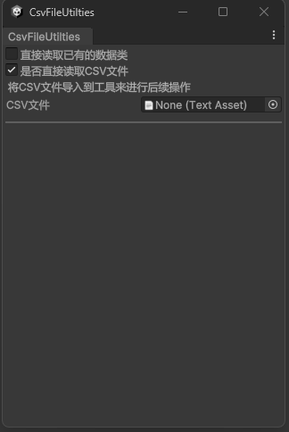

# 工作流流程

## 创建你的Excel配置表

首先，配置表的格式为：
1. 第一列为各行数据的名称，如：

| ID | 名称 | 属性 | 描述 |
| :-: | :-: | :-: | :-: |

2. 第二列为数据在脚本中的名称，如：

| id | name | props | desc |
| :-: | :-: | :-: | :-: |

3. 第三列开始，为数据表中的具体数据。这边根据上面配置的数据格式依次填入数据即可。

表的总览如图所示。该表仅作参考，实际需求按照实际的情况配置。


## 读取并分离表格和Sheet

配置完表格后，我们就准备着手开始读表和导出为CSV文件了。

:::tip[对于策划的小提示]
    表格中不需要导出的表格Sheet前加上temp_，该Sheet就不会被导出作为实际数据项使用。
:::

首先，在导出之前，先确认自己是否保存了Excel；未保存的话**一定要记得保存**！  
保存完之后，找到 `convert.py` ，运行脚本：
```bash
python convertxlsx.py
```
若未安装Python，可以前往[Python.org](https://python.org)安装python。  
在确认这个脚本所在的目录下有所有需要转换的Excel表格后，按下回车即可开始转换啦!

:::danger[报错警告]
    不要在打开Excel文件的情况下运行脚本，否则必定报错！  
    因为xlsx文件会创建一个隐形文件作为修改的副本，这个文件是一个只属于C盘的temp文件，读取会出现问题。
:::

转换完成后的表格会在 `converted_sheets` 文件夹下，并且控制台上会有以下提示：



那么，恭喜你，你已经完成了Excel表格到CSV的流程！  
接下来，我们将开始将CSV导入到Unity，并在Unity里进行数据导入的操作。

## 在Unity中处理转换后的CSV

那么，接下来就是重头戏！我们将要将CSV表格转换到Unity中，变成可以给Unity使用的实际数据。  

### 为什么使用SO？

ScriptableObject（简称SO），是Unity所支持的专有的类。这个类既能像json一般长久化存储固定值的数据，又可以像类一样加入自己拥有的方法和参数。因此这个类有很强的灵活性。

与Json文件相比，优点：
- 格式更加灵活
- 可以编写自有方法或枚举
- 使用上等于一个正常的类
- 无需从文本解码
- 可以直接存放Sprites等资源

缺点：
- 需要Resource.Load()或者File.Read()操作来读取文件
- 修改数据时不直观，且是以非文本形式保存数据
- 限制大，仅限Unity使用

因此，需要均衡各方长短来做出具体的解决方案。  
它们之间的共同点：
- 都是数据存储结构
- 体积小
- 不能存储动态变化的数据，仅能在数据完成改变后存储其某个时刻的值或者集合

### 处理转换后的CSV

首先，确认项目中已经导入了 `CsvFileUtilties.cs` 和 `CsvHandler.cs` 两个脚本。  
导入之后，在Unity上方的Windows窗口，会有一个新的选项，名为`CSV Utilities`。打开CSV Utilities，会看到如下的窗口：



在该窗口中，可以看到两个选项：
- 直接读取已有的数据类
- 是否直接读取CSV文件

勾选直接读取CSV类时，方法会以已经有一个类为基础，制作数据SO。一般用于一个类有多个不同的变体，如技能不仅分普攻和魔法，还分玩家技能和Boss技能，这时这两个不同对象就要做出区分。（这里仅作举例，实际以具体使用环境为基准）

是否直接读取CSV文件的选项，勾选和不勾选会有两种不同的形式。若勾选，则是直接可以将CSV文件，拖拽到编辑器框中来读取表格；若是未勾选，则是通过文件绝对路径搜索文件所在的位置。

**为什么要用绝对路径？**

因为有时候，策划可能不会把配置表随项目打包，而是单独放在某一个路径下，因此需要一个绝对路径。

:::warning[注意事项]
    文件路径默认为以 **/** 划分文件夹，若出现了 **\\** 时，请将它改成 **/** 。
:::

### 将CSV转换成类

在顺利导入了CSV类（不论是直接拖拽文件还是输入问价路径）后，会弹出如图的几个按钮，表示可以将CSV文件进行转换。


在新的页面中，可以看到如下几个选项：
- 导出CSV类
- 读取数据并创建SO
- 自选保存路径创建SO

其中，读取数据并创建SO以及自选保存路径创建SO都需要先创建类之后才能正常使用。  
在正确拖拽了文件或者正确输入了文件所在的绝对路径后，输入需要创建的类的名字，然后输入这个类保存的项目路径，即可在这个项目路径下创建一个全新的类。然后，基于这个类，就可以执行下面创建数据Asset的步骤了。

成功创建类之后的提示如下：


若是关掉了这个页签，但已经创建好了类，请参照之后介绍的 [已有数据类转换成SO](#已有数据类转换成so) 的部分。

### 将类转换成SO

创建完类之后，就可以来创建SO了。

创建SO的方法很简单，首先检查上面文件名是否填写，填写完成后填入SO的保存路径（若上面创建类之后没有关掉或修改，可以直接使用上面的配置）。检查完成后可以选择直接点击 ***读取数据并创建SO***，然后SO就会出现在文件夹里啦！  
当然，你也可以选择点击 ***自选保存路径创建SO*** 来自己选择保存的路径来保存SO。  
导出之后，SO Asset文件会出现在文件夹下，如下图所示。  


### 已有数据类转换成SO

若已经创建过数据类了，但还想根据这个数据类额外创建其他扩展的SO数据，可以将上面的 ***直接读取已有的数据类*** 勾选，然后就会进入直接创建SO的模式。  
和上面一样，只要正确输入了类名以及保存路径，就可以顺利保存了。

:::tip[小的缺陷以及后续改进]
因为前期设计时的不足，在这里若是输入了和类名不一致的数据，可能会出现无法顺利导出的问题。后续我会将类的读取通过拖拽的形式添加，然后再是直接输入文件名。
:::

导出完成后，就能看到指定文件目录下出现了带有配置表中相同数据的SO文件啦！

